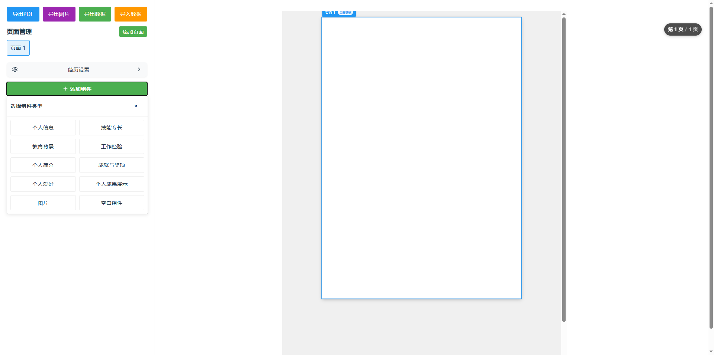
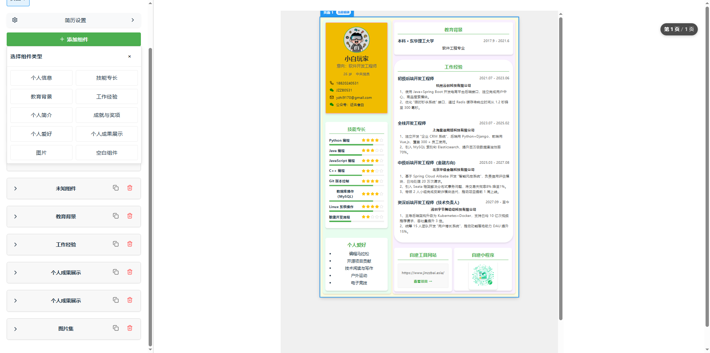

# 📝 简历生成器

<div align="center">
  


</div>

<p align="center">一个功能强大的React简历制作工具，帮助求职者快速创建专业、个性化的简历。</p>

## ✨ 功能特点

- **📋 组件化设计** - 个人信息、技能、教育背景、工作经验等模块自由组合和定制
- **🖱️ 拖拽式布局** - 通过直观的拖拽操作调整组件位置和大小
- **🎨 丰富样式选项** - 自定义主题色、字体、边框和阴影效果，打造个性化简历
- **💾 专业导出** - 一键生成高质量PDF格式简历，随时打印或在线投递
- **📱 响应式设计** - 完美适配A4纸张规格，确保打印效果专业美观
- **💡 用户友好** - 简洁直观的界面设计，操作便捷，上手容易

## 📸 应用截图

> 注意：请上传实际截图到`screenshots`目录下


*首页展示了所有可用的简历模板和主要功能*


*强大的编辑界面，支持拖拽、样式调整和实时预览*


*导出效果预览，确保简历格式规范专业*

## 🛠️ 技术栈

- **前端框架**: [React 18](https://reactjs.org/) - 用于构建用户界面的JavaScript库
- **样式解决方案**: [Tailwind CSS 3](https://tailwindcss.com/) - 实用优先的CSS框架
- **构建工具**: [Vite 4](https://vitejs.dev/) - 快速的前端构建工具
- **PDF生成**: [HTML2PDF.js](https://html2pdf.js.org/) - 高质量HTML到PDF的转换
- **图标库**: [React Icons](https://react-icons.github.io/react-icons/) - 流行的图标集合
- **UI组件**: 自定义的拖拽、编辑和预览组件

## 🚀 快速开始

### 前置要求

- Node.js (版本 14.0 或更高)
- npm 或 yarn

### 安装步骤

1. **克隆仓库**
   ```bash
   git clone https://github.com/您的用户名/resume-generator.git
   cd resume-generator
   ```

2. **安装依赖**
   ```bash
   # 主项目依赖
   npm install
   
   # 进入应用目录安装依赖
   cd resume-app
   npm install
   ```

3. **启动开发服务器**
   ```bash
   npm run dev
   # 或
   yarn dev
   ```

4. **打开浏览器访问** 
   
   [http://localhost:5173](http://localhost:5173)

## 💻 使用指南

### 基础使用流程

1. **选择组件** - 从左侧组件库中选择需要的模块
2. **编辑布局** - 拖拽调整组件位置和大小
3. **填写内容** - 在右侧编辑面板中填写个人信息和经历
4. **调整样式** - 自定义颜色、字体、间距等样式选项
5. **预览效果** - 实时查看简历的最终呈现效果
6. **导出PDF** - 点击"导出PDF"按钮生成可打印的简历文件

### 高级技巧

- **模板保存** - 可以保存当前编辑的简历模板以便将来使用
- **多主题切换** - 提供多种预设主题，一键切换简历风格
- **自定义字体** - 支持选择不同字体和字号，适应不同行业需求
- **响应式设计** - 简历在不同显示设备上都能保持美观

## 🤝 贡献指南

欢迎为项目做出贡献！以下是参与方式：

1. Fork 项目仓库
2. 创建您的功能分支 (`git checkout -b feature/AmazingFeature`)
3. 提交您的更改 (`git commit -m 'Add some AmazingFeature'`)
4. 推送到分支 (`git push origin feature/AmazingFeature`)
5. 开启 Pull Request

## 📝 许可证

[MIT](LICENSE) - 见 LICENSE 文件了解详情